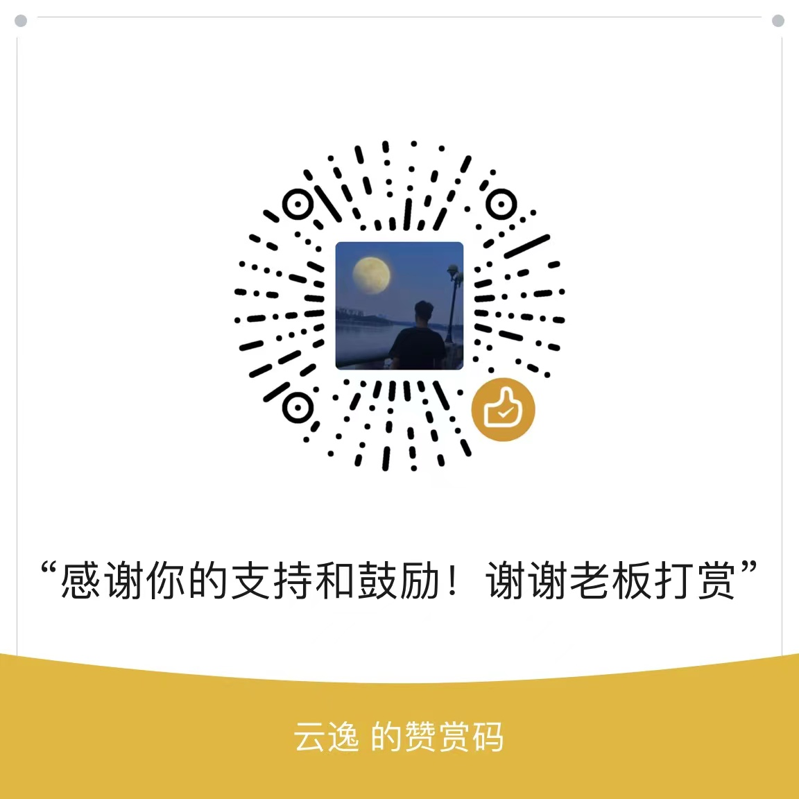

# Spring oauth2 authorization server示例项目

## 项目说明

Spring OAuth2 Authorization Server集成与拓展项目，包括认证服务搭建、三方登录对接、自定义grant_type方式获取token、前后端分离实现，客户端、资源服务、前端单体项目对接认证服务实现等。

## 项目Wiki地址(持续更新)

[Wiki](https://gitee.com/vains-Sofia/authorization-example/wikis/pages)

## 登录流程演示地址
[演示地址](https://vains-sofia.gitee.io)

网速较慢，各位体谅一下

## 交流群
[724141959](http://qm.qq.com/cgi-bin/qm/qr?_wv=1027&k=TJ6P1zOGofljK4xxnRrmn_3p42V995OD&authKey=h3YWSUIJXL23m34ATDfWlYa61UQRyBRxBpoMnDGoU%2BJKKfcHWGYMZC9bAJ%2FZ69Ax&noverify=0&group_code=724141959)

## 项目支持的授权方式

授权码模式

客户端模式

授权码扩展流程PKCE(Proof Key for Code Exchange)

设备码授权模式

短信验证码登录

自定义grant_type

授权码模式使用前后端分离的登录页面

联合身份认证(现已集成Github、Gitee登录和微信登录)

## 项目环境要求

**Java版本大于等于17**

**Springboot版本大于等于3.1.0-RC1**

**IDE安装Lombok插件**

## 仓库内项目结构

```
authorization-example # 最外层目录
 │  README.md # 项目描述文件
 │  
 ├─authorization-server # 认证服务器
 │  
 ├─authorization-client-example # 客户端集成示例
 │  
 ├─resource-server-example # Resource Server集成示例
 │  
 ├─vue-login-page-example # 前后端登录中的前端模块
 │  
 └─gateway-example # 网关集成OAuth2认证服务示例
     │  
     ├─gateway-client-example # 网关
     │  
     ├─normal-resource-example # webmvc资源服务
     │  
     ├─webflux-resource-example # webflux资源服务
     │  
     └─pom.xml # 公共依赖，依赖管理
```

## 文章地址

### 掘金

**[Spring Authorization Server入门 (一) 初识SpringAuthorizationServer和OAuth2.1协议](https://juejin.cn/post/7239953874950733884)**<br>
**[Spring Authorization Server入门 (二) springboot整合Spring Authorization Server](https://juejin.cn/post/7239953874950815804)**<br>
**[Spring Authorization Server入门 (三) 集成流程说明、细节补充和各种方式获取token测试](https://juejin.cn/post/7241058098974720037)**<br>
**[Spring Authorization Server入门 (四) 自定义设备码授权](https://juejin.cn/post/7241101553712283707)**<br>
**[Spring Authorization Server入门 (五) 自定义异常响应配置](https://juejin.cn/post/7241439405970063416)**<br>
**[Spring Authorization Server入门 (六) 自定义JWT中携带的claims与资源服务jwt解析器](https://juejin.cn/post/7241762957570097213)**<br>
**[Spring Authorization Server入门 (七) 登录添加图形验证码](https://juejin.cn/post/7242476048005709879)**<br>
**[Spring Authorization Server入门 (八) Spring Boot引入Security OAuth2 Client对接认证服务](https://juejin.cn/spost/7243725197911834683)**<br>
**[Spring Authorization Server入门 (九) Spring Boot引入Resource Server对接认证服务](https://juejin.cn/spost/7244043482772029498)**<br>
**[Spring Authorization Server入门 (十) 添加短信验证码方式登录](https://juejin.cn/post/7245538214114492474)**<br>
**[Spring Authorization Server入门 (十一) 自定义grant_type(短信认证登录)获取token](https://juejin.cn/post/7246409673565372475)**<br>
**[Spring Authorization Server入门 (十二) 实现授权码模式使用前后端分离的登录页面](https://juejin.cn/post/7254096495184134181)**<br>
**[Spring Authorization Server入门 (十三) 实现联合身份认证，集成Github与Gitee的OAuth登录](https://juejin.cn/post/7258466145653096504)**<br>
**[Spring Authorization Server入门 (十四) 联合身份认证添加微信登录](https://juejin.cn/post/7261098261142208568)**<br>
**[Spring Authorization Server入门 (十五) 分离授权确认与设备码校验页面](https://juejin.cn/post/7262317630307205176)**<br>
**[Spring Authorization Server入门 (十六) Spring Cloud Gateway对接认证服务](https://juejin.cn/spost/7271496874942890024)**<br>
**[Spring Authorization Server入门 (十七) Vue项目使用授权码模式对接认证服务](https://juejin.cn/post/7279052777888890921)**<br>
**[Spring Authorization Server入门 (十八) Vue项目使用PKCE模式对接认证服务](https://juejin.cn/post/7279265985912225828)**<br>
**[Spring Authorization Server入门 (十九) 基于Redis的Token、客户端信息和授权确认信息存储](https://juejin.cn/post/7294853623849254946)**<br>

### CSDN

**[Spring Authorization Server入门 (一) 初识SpringAuthorizationServer和OAuth2.1协议](https://blog.csdn.net/weixin_43356507/article/details/130991406)**<br>
**[Spring Authorization Server入门 (二) springboot整合Spring Authorization Server](https://blog.csdn.net/weixin_43356507/article/details/131006763)**<br>
**[Spring Authorization Server入门 (三) 集成流程说明、细节补充和各种方式获取token测试](https://blog.csdn.net/weixin_43356507/article/details/131023147)**<br>
**[Spring Authorization Server入门 (四) 自定义设备码授权](https://blog.csdn.net/weixin_43356507/article/details/131050408)**<br>
**[Spring Authorization Server入门 (五) 自定义异常响应配置](https://blog.csdn.net/weixin_43356507/article/details/131063392)**<br>
**[Spring Authorization Server入门 (六) 自定义JWT中携带的claims与资源服务jwt解析器](https://blog.csdn.net/weixin_43356507/article/details/131081862)**<br>
**[Spring Authorization Server入门 (七) 登录添加图形验证码](https://blog.csdn.net/weixin_43356507/article/details/131109818)**<br>
**[Spring Authorization Server入门 (八) Spring Boot引入Security OAuth2 Client对接认证服务](https://blog.csdn.net/weixin_43356507/article/details/131173945)**<br>
**[Spring Authorization Server入门 (九) Spring Boot引入Resource Server对接认证服务](https://blog.csdn.net/weixin_43356507/article/details/131190785)**<br>
**[Spring Authorization Server入门 (十) 添加短信验证码方式登录](https://blog.csdn.net/weixin_43356507/article/details/131262461)**<br>
**[Spring Authorization Server入门 (十一) 自定义grant_type(短信认证登录)获取token](https://blog.csdn.net/weixin_43356507/article/details/131297456)**<br>
**[Spring Authorization Server入门 (十二) 实现授权码模式使用前后端分离的登录页面](https://blog.csdn.net/weixin_43356507/article/details/131650660)**<br>
**[Spring Authorization Server入门 (十三) 实现联合身份认证，集成Github与Gitee的OAuth登录](https://blog.csdn.net/weixin_43356507/article/details/131872353)**<br>
**[Spring Authorization Server入门 (十四) 联合身份认证添加微信登录](https://blog.csdn.net/weixin_43356507/article/details/131998050)**<br>
**[Spring Authorization Server入门 (十五) 分离授权确认与设备码校验页面](https://blog.csdn.net/weixin_43356507/article/details/132052355)**<br>
**[Spring Authorization Server入门 (十六) Spring Cloud Gateway对接认证服务](https://blog.csdn.net/weixin_43356507/article/details/132517747)**<br>
**[Spring Authorization Server入门 (十七) Vue项目使用授权码模式对接认证服务](https://blog.csdn.net/weixin_43356507/article/details/132949746)**<br>
**[Spring Authorization Server入门 (十八) Vue项目使用PKCE模式对接认证服务](https://blog.csdn.net/weixin_43356507/article/details/132949801)**<br>
**[Spring Authorization Server入门 (十九) 基于Redis的Token、客户端信息和授权确认信息存储](https://blog.csdn.net/weixin_43356507/article/details/134098583)**<br>

## 赞赏

**如果各位觉得项目或文章还不错的，麻烦帮忙点个star，谢谢**<br />
**也可以通过下方二维码进行赞赏，请作者喝一杯Coffee，非常感谢！**



## 感谢人列表

| 赞助人昵称 | 金额 | 赞助方式 | 附言               |
| ---------- | ---- | -------- | ------------------ |
| 寒雨潇何   | 10   | 赞赏码   | 感谢老哥的无私付出 |
| 寒雨潇何   | 10   | 赞赏码   | 再次感谢老哥的指导 |
| 唐亚峰 &#124; battcn   | 88   | 微信红包   | 喝杯咖啡 |
| HWF   | 68   | 赞赏码   | 非常好的项目 :clap: :clap: :clap: |
| 恒辉   | 12.88   | 微信红包   | 非常感谢大佬，辛苦啦 |
| Eric   | 10   | 赞赏码   | 感谢大佬开源项目，学到很多。 |
| Eric   | 10   | 赞赏码   | 感谢大佬指导 |
| WestonLee   | 18.88   | 赞赏码   | ctrl+c ctrl+v 上线 |
| 贱贱   | 20   | 赞赏码   | 搞个交流群!!! |
| Eric   | 10   | 赞赏码   | 大佬 国庆快乐 :+1:  |
| outas   | 66   | 赞赏码  | 感谢指导 |
| 宫城良田   | 18.88   | 赞赏码  | 感谢大佬指导 |
| mango   | 20   | 赞赏码  | nice work |
| \*\*\*(匿名)  | 100   | 微信红包  | 写的太好啦 哥们继续努力 |
| Q  | 28.88   | 赞赏码  | 感谢大佬的指导 |
| 小增  | 5   | 赞赏码  | c v即将上线，喝个快乐水 |
| Q  | 10   | 赞赏码  | 感谢指导，文章非常好 |
| alpha  | 66   | 赞赏码  | 感谢大佬开源项目，感谢指导 |
| 文  | 20   | 赞赏码  | 感谢大佬，奉献如此好的项目 |
| Q  | 10   | 微信红包  | - |
| 向阳  | 30   | 赞赏码  | 大佬天冷了喝杯恰啡 |
| HWF  | 18   | 赞赏码  | 喝杯奶茶，暖暖身子 |
| gn  | 20   | 赞赏码  | 大佬文档写的好，出了问题还无私 |
| gn  | 20   | 赞赏码  | 刚才少了，在赞助下 |
| gn  | 20   | 赞赏码  | 感谢支持 |


**非常感谢以上小伙伴的打赏！感谢**

